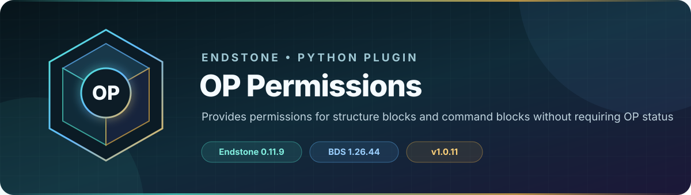

<!-- endstone-professional-header:start -->
<p align="center">
  
</p>

<p align="center">
  <a href="https://github.com/TheNINJALLO/endstone-op-permissions/actions/workflows/wheel-release.yml"></a>
  <a href="https://github.com/TheNINJALLO/endstone-op-permissions/releases/latest"></a>
</p>

<p align="center">
  
  
  
  =3.10" src="https://img.shields.io/badge/Python-%3E=3.10-3776AB?style=flat-square&amp;logo=python&amp;logoColor=white">
</p>

<p align="center">
  <strong>Provides permissions for structure blocks and command blocks without requiring OP status.</strong>
</p>

<p align="center">
  <a href="#what-it-does">What it does</a> &bull;
  <a href="#how-to-use">How to use</a> &bull;
  <a href="#commands-and-permissions">Commands</a> &bull;
  <a href="#install">Install</a> &bull;
  <a href="https://github.com/TheNINJALLO/endstone-op-permissions/releases">Releases</a>
</p>

## Overview

Provides permissions for structure blocks and command blocks without requiring OP status. This release is aligned with Endstone 0.11.8 and Minecraft Bedrock Dedicated Server 1.26.40, and is distributed as a Python wheel for direct installation in an Endstone server.

## What it does

- Allows trusted non-operators to use structure blocks or command blocks through separate permissions.
- Cancels protected interactions unless the player is an operator or holds the matching permission.
- Reloads the generated permission configuration without a full server restart.

## How to use

1. Grant `op.permissions.structure_block` and/or `op.permissions.command_block` through your Endstone permission manager.
2. Have the non-operator test only the block type they were assigned.
3. Run `/opreload` after editing the plugin's local permission configuration and revoke permissions when no longer needed.

## Commands and permissions

| Command / usage | What it does | Access |
|---|---|---|
| `/opreload` | Reload the OP Permissions configuration | `op.permissions.reload` |

## Compatibility

| Component | Supported version |
|---|---|
| Endstone | `0.11.8` |
| Endstone API | `0.11` |
| Bedrock Dedicated Server | `1.26.40` |
| Python | `>=3.10` |
| Plugin release | `v1.0.11` |

## Install

Download the wheel from the matching GitHub release:

```bash
gh release download v1.0.11 --repo TheNINJALLO/endstone-op-permissions --pattern "*.whl"
```

Copy the downloaded wheel into the server's `plugins/` directory, remove any older wheel for the same plugin, and restart Endstone.

> [!IMPORTANT]
> Use Endstone `0.11.8` with BDS `1.26.40`. Back up worlds and plugin data before upgrading a production server.

## Configuration and secrets

Runtime databases, logs, local `.env` files, server directories, and root `config.toml` files are excluded from source releases. When an example configuration is provided, copy it locally and keep live tokens, passwords, webhook URLs, and server identifiers out of Git.

## Release automation

Every `v*` tag runs [the wheel release workflow](.github/workflows/wheel-release.yml), builds the package in a clean GitHub runner, stores the wheel as a workflow artifact, and attaches it to the matching GitHub release.
<!-- endstone-professional-header:end -->

---

## Project guide

An Endstone plugin that provides granular permissions for Structure Blocks and Command Blocks without requiring operator status.

## Features

- **Structure Block Permission**: Grant players access to structure blocks without making them operators
- **Command Block Permission**: Grant players access to command blocks without making them operators
- **Configurable**: Enable/disable features through a config file
- **Live Reload**: Reload configuration without restarting the server
- **Operator Override**: Operators always have access regardless of permissions

## Permissions

- `op.permissions.structure_block` - Allows players to interact with structure blocks
- `op.permissions.command_block` - Allows players to interact with command blocks

## Commands

- `/opreload` - Reloads the plugin configuration (requires `op.permissions.reload` permission)

## Configuration

The plugin creates a `config.json` file in the plugin's data folder with the following options:

```json
{
    "enable_structure_block_permission": true,
    "enable_command_block_permission": true,
    "debug_mode": false
}
```

- `enable_structure_block_permission`: Enable/disable structure block permission checking
- `enable_command_block_permission`: Enable/disable command block permission checking
- `debug_mode`: Enable debug logging for troubleshooting

## Installation

1. Ensure you have Endstone server installed
2. Copy the plugin directory to your server's plugins folder
3. Start the server to generate the default configuration
4. Edit the configuration as needed
5. Use `/opreload` or restart the server to apply changes

## Usage

### Granting Permissions

To grant a player permission to use structure blocks:
```
/permission add <player> op.permissions.structure_block
```

To grant a player permission to use command blocks:
```
/permission add <player> op.permissions.command_block
```

### Revoking Permissions

```
/permission remove <player> op.permissions.structure_block
/permission remove <player> op.permissions.command_block
```

## How It Works

1. The plugin listens for `PlayerInteractEvent` when players right-click blocks
2. When a player interacts with a structure block or command block:
   - If the player is an operator, allow interaction (bypass)
   - If the player has the appropriate permission, allow interaction
   - If neither condition is met, cancel the interaction and notify the player
3. This allows fine-grained control over who can use these powerful blocks

## API Version

This plugin targets Endstone API version 0.5

## License

MIT License

## Support

For issues or feature requests, please contact the server administrators.
